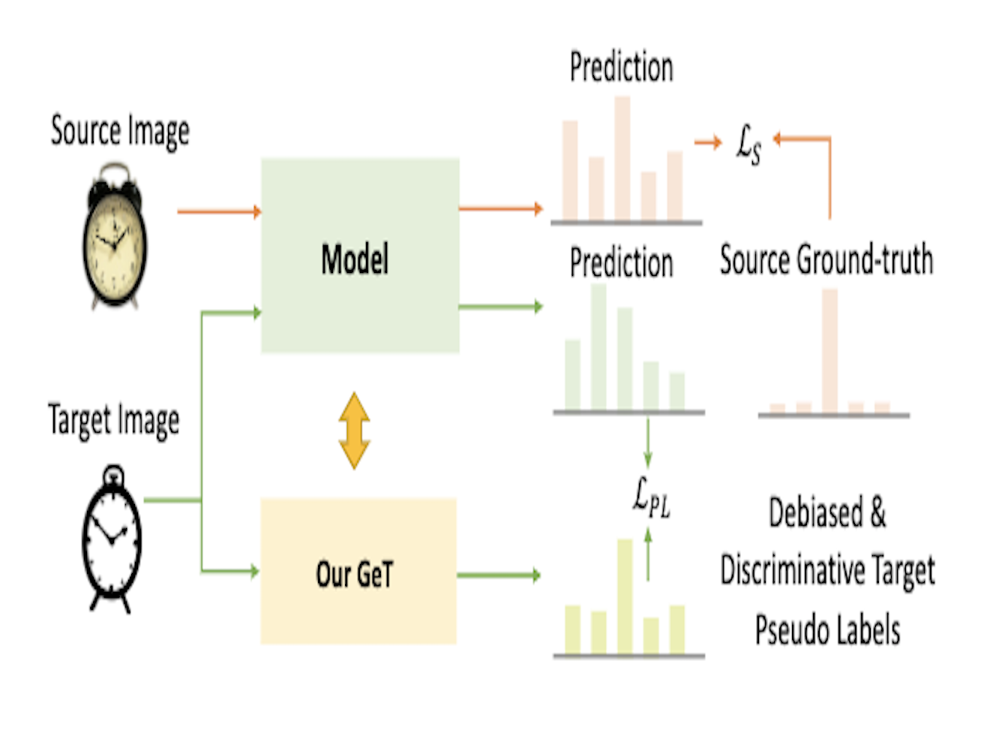
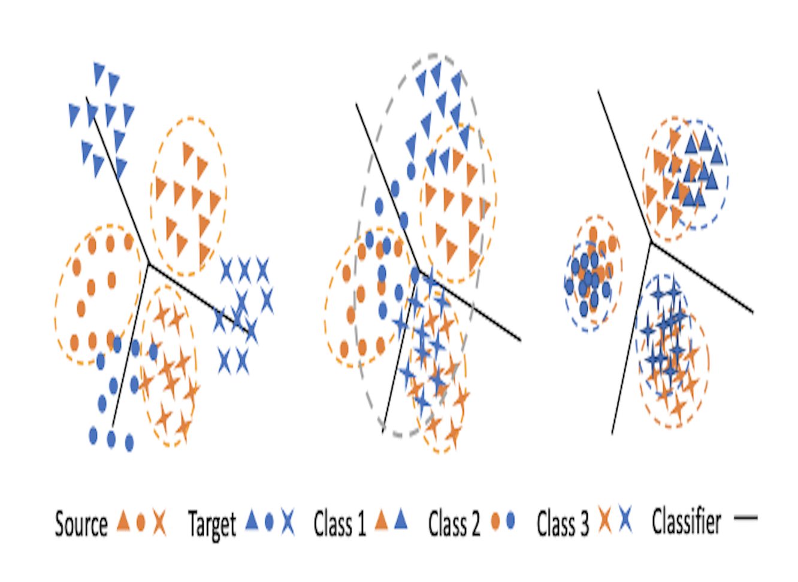

## Welcome!
I am currently a Ph.D. Candidate at the Department of Computer Science, National University of Singapore (NUS).
<!---
, advised by Prof. [Gim Hee Lee](https://www.comp.nus.edu.sg/~leegh/). 
I obtained my B.S. degree in Electronic Information School from Wuhan University. 
-->

<!---
## Experience

- **Google Research**, Student Researcher
   
  Hosted by [Alonso Martinez](https://www.linkedin.com/in/alonsomartinez/) and [Krishna Somandepalli](https://sail.usc.edu/~somandep/)  (Starting Sep. 2023)
- **Fast Campus**, Lecturer in AI
   
  Letcure title: [Mastering GANs through Model Implementation](https://fastcampus.co.kr/data_online_ganmodel) (Nov. 2022 - Present)
-->

## Research Interests
My research interests lie broadly in the field of computer vision (CV), machine learning (ML). Specifically, my work explores the following areas:
- **Domain adaptation**
- **Semi-, Un- and Self-supervised learning**
- **3D reconstruction** 
- **Multi/Cross-modal learning**
- **Continual learning**
- **Recommender system**
- but not limited to.

## <b style="color:#F88017">News</b>

- **[Jul. 2023]** [Get](https://lulusindazc.github.io/getproject/) on domain adaptation is accepted to [ICCV 2023](https://iccv2023.thecvf.com/).
- **[Jul. 2023]** [DG-UCDIR](https://github.com/conghui1002/DG-UCDIR) on cross-domain image retrieval is accepted to [ICCV 2023](https://iccv2023.thecvf.com/).
- **[Mar. 2022]** [Miss](https://arxiv.org/pdf/2111.15068.pdf) on CTR prediction is accepted to [ICDE 2022](https://icde2022.ieeecomputer.my/).
- **[May. 2022]** [CA-UDA](https://arxiv.org/pdf/2205.13579.pdf) on domain adaptation is available on arXiv.
- **[Oct. 2020]** [MPSD](https://ieeexplore.ieee.org/abstract/document/9412119) on surface defection is accepted to [ICPR 2020](https://www.micc.unifi.it/icpr2020/).
- **[Oct. 2020]** [MSPAC](https://arxiv.org/pdf/2012.06843.pdf) on RGB-Infrared person re-identification is accepted to [ICPR 2020](https://www.micc.unifi.it/icpr2020/).
- **[May 2020]** [MBCN](https://dl.acm.org/doi/abs/10.1145/3397271.3401218) on recommendation is accepted to [SIGIR 2020](https://sigir.org/sigir2020/).

## Research

<ol class="bibliography">

<li>

  

    
  

  

      
<a href="======">GeT: Generative Target Structure Debiasing for Domain Adaptation</a>

      
<strong>Can Zhang</strong>, Gim Hee Lee

      
<em><strong>ICCV, 2023</strong></em>
      

    

      <a href="======" class="btn btn-sm z-depth-0" role="button" target="_blank" style="font-size:12px;">PDF</a>
      <a href="https://lulusindazc.github.io/getproject/" class="btn btn-sm z-depth-0" role="button" target="_blank" style="font-size:12px;">Project page</a>
      <a href="======" class="btn btn-sm z-depth-0" role="button" target="_blank" style="font-size:12px;">Code</a>
    

  

</li>

<li>

  

    
  

  

      
<a href="======">Unsupervised Feature Representation Learning for Domain-generalized Cross-domain Image Retrieval</a>

      
Conghui Hu, <strong>Can Zhang</strong>, Gim Hee Lee

      
<em><strong>ICCV, 2023</strong></em>
      

    

      <a href="======" class="btn btn-sm z-depth-0" role="button" target="_blank" style="font-size:12px;">PDF</a>
      <a href="https://lulusindazc.github.io/getproject/" class="btn btn-sm z-depth-0" role="button" target="_blank" style="font-size:12px;">Project page</a>
      <a href="======" class="btn btn-sm z-depth-0" role="button" target="_blank" style="font-size:12px;">Code</a>
    

  

</li>

<li>

  

    
  

  

      
<a href="https://arxiv.org/pdf/2111.15068.pdf">Miss: Multi-interest self-supervised learning framework for click-through rate prediction</a>

      
Wei Guo*, <strong>Can Zhang*</strong>, Zhicheng He*, Jiarui Qin, Huifeng Guo, Bo Chen, Ruiming Tang, Xiuqiang He, Rui Zhang <strong>(*co-first)</strong> 

      
<em><strong>ICDE, 2022</strong></em>
      

    

      <a href="https://arxiv.org/pdf/2111.15068.pdf" class="btn btn-sm z-depth-0" role="button" target="_blank" style="font-size:12px;">PDF</a>
      <a href="" class="btn btn-sm z-depth-0" role="button" target="_blank" style="font-size:12px;">Project page</a>
      <a href="" class="btn btn-sm z-depth-0" role="button" target="_blank" style="font-size:12px;">Code</a>
    

  

</li>

<li>

  

    
  

  

      
<a href="https://arxiv.org/pdf/2205.13579.pdf">CA-UDA: Class-Aware Unsupervised Domain Adaptation with Optimal Assignment and Pseudo-Label Refinement</a>

      
<strong>Can Zhang</strong>, Gim Hee Lee 

      
<em><strong>arXiv, 2022</strong></em>
      

    

      <a href="https://arxiv.org/pdf/2205.13579.pdf" class="btn btn-sm z-depth-0" role="button" target="_blank" style="font-size:12px;">PDF</a>
      <a href=" " class="btn btn-sm z-depth-0" role="button" target="_blank" style="font-size:12px;">Project page</a>
      <a href=" " class="btn btn-sm z-depth-0" role="button" target="_blank" style="font-size:12px;">Code</a>
      <a href=" " class="btn btn-sm z-depth-0" role="button" target="_blank" style="font-size:12px;">Demo</a>
    

  

</li>

<li>

  

    
  

  

      
<a href="https://arxiv.org/pdf/2012.06843.pdf">Multi-Scale Cascading Network with Compact Feature Learning for RGB-Infrared Person Re-Identification</a>

      
<strong>Can Zhang</strong>, Hong Liu, Wei Guo, Mang Ye 

      
<em><strong>ICPR, 2020 </strong></em>
      

    

      <a href="https://arxiv.org/pdf/2012.06843.pdf" class="btn btn-sm z-depth-0" role="button" target="_blank" style="font-size:12px;">PDF</a>
    

  

</li>

<li>

  

    
  

  

      
<a href="https://ieeexplore.ieee.org/abstract/document/9412119">Mobile Phone Surface Defect Detection Based on Improved Faster R-CNN</a>

      
Tao Wang, <strong>Can Zhang</strong>, Runwei Ding, Ge Yang 

      
<em><strong>ICPR, 2020</strong></em>
      

    

      <a href="https://ieeexplore.ieee.org/abstract/document/9412119" class="btn btn-sm z-depth-0" role="button" target="_blank" style="font-size:12px;">PDF</a>
    

  

</li>

<li>

  

    
  

  

      
<a href="https://dl.acm.org/doi/abs/10.1145/3397271.3401218">Multi-Branch Convolutional Network for Context-Aware Recommendation</a>

      
Wei Guo*, <strong>Can Zhang*</strong>, Huifeng Guo, Ruiming Tang, Xiuqiang He <strong>(*co-first)</strong> 

      
<em><strong>SIGIR, 2020 </strong></em>
      

    

      <a href="https://papers.nips.cc/paper/2021/file/ceb0595112db2513b9325a85761b7310-Paper.pdf" class="btn btn-sm z-depth-0" role="button" target="_blank" style="font-size:12px;">PDF</a>
    

  

</li>

</ol>

<!---
## Patents

- **Computer Software Copyright Registration Certificate on Safety Belt Recognition**
   
  **Can Zhang**, Wen Yang
   
  National Copyright Administration of the People's Republic of China, No. 01871413, 2017
-->

## Awards and Honors

- National Scholarship, 2017
- National Scholarship, 2016
- National Scholarship, 2015
- Outstanding Freshmen Scholarship, WHU, 2014
 
Teaching Assistant
------
2018/2019 Semester 1:  Scientific Quality and Research Methods, PKU \
2020/2021 Semester 2:  CS5477 3D Computer Vision, NUS \
2021/2022 Semester 1:  CS5340 Uncertainty Modelling in AI, NUS

<!---
## Invited Talks

- **Text-driven Control of 2D/3D Image Using Diffusion:
DiffusionCLIP and DATID-3D**
   
  Innerverz Seminar, Innerverz (Remote), 2023
- **DiffusionCLIP: Text-Guided Diffusion Models for Robust Image Manipulation**
   
  London Machine Learning Meetup, London Machine Learning Group (Remote), 2022
- **Diffusion Models for Vision-Language Tasks**
   
  Kakao Brain Open Seminar, Kakao Brain, 2022
- **Deep Learning based Diagnosis of Infectious Diseases on CXR and Audio data**
   
  NVIDIA AI Developer Meetup, NVIDIA (Remote), 2020

## Services
- **Conference reviewers:** CVPR 2023, ICCV 2023, NeurIPS 2023
- **Journal Reviewers:** T-PAMI, ACM Comput Surv
-->

[//]: # (## Projects)

[//]: # ()
[//]: # (- **Development of AI Modules for Smart X-ray Screening Systems**)

[//]: # (   )

[//]: # (  Conducted by Korea Customs Service, 2021 - 2021)

[//]: # (   )

[//]: # (  Algorithm development)

[//]: # ()
[//]: # (- **AI Chest X-ray Rapid Diagnosis**)

[//]: # (   )

[//]: # (  Conducted by Korea Aid for Respiratory Epidemic, 2020 - 2021)

[//]: # (   )

[//]: # (  Algorithm development, System deployment, Clinical trial preparation)

